# FireWalletBrowser
## Installation

```bash
git clone https://github.com/Nathanwoodburn/firewalletbrowser.git
cd firewalletbrowser
python3 -m pip install -r requirements.txt
cp example.env .env
```

Edit .env to have your HSD api key.
If you have HSD runnning on a separate computer also add the IP here

## Usage

Make sure HSD is running then run the following commands:

On Linux:
```bash
python3 server.py
# Or for more verbose output
python3 main.py
```

On Windows:
```bash
python3 main.py
```


Then access the wallet at http://localhost:5000


Also available as a docker image:
To run using a HSD running directly on the host:

```bash
sudo docker run --network=host -e hsd_api=yourapikeyhere git.woodburn.au/nathanwoodburn/firewallet:latest
```

If you have HSD running on a different IP/container

```bash
sudo docker run -p 5000:5000 -e hsd_api=yourapikeyhere -e hsd_ip=hsdcontainer git.woodburn.au/nathanwoodburn/firewallet:latest
```

For Docker you can mount a volume to persist the user data (/app/user_data)

## Features
- Basic wallet functionality
  - Create new wallet
  - Import wallet from seed
  - Send HNS
  - Receive HNS
  - Have multiple wallets
  - View transactions
  - View balance
  - View wallet domains
- Domain management
  - Transfer domains
  - DNS Editor
  - Renew domains
- Auctions
  - Send open
  - Send bid
  - Send reveal
  - Send redeem
- Download a list of all domains
- Resend all pending transactions
- Rescan
- Zap pending transactions
- View xPub
- Custom plugin support

## Themes
Set a theme in the .env file  
**Available themes**  
- dark-purple
- black

## Images
Login page  
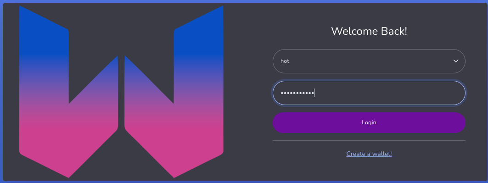

Home page  
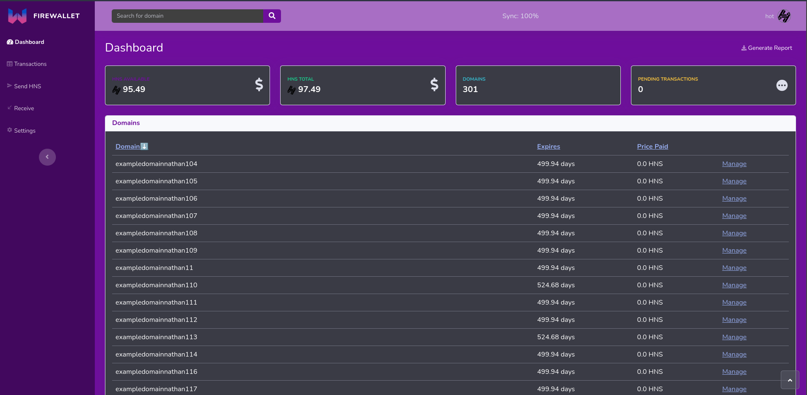

Transactions page  
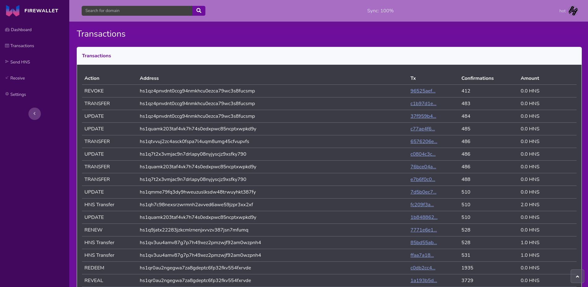

Send page  
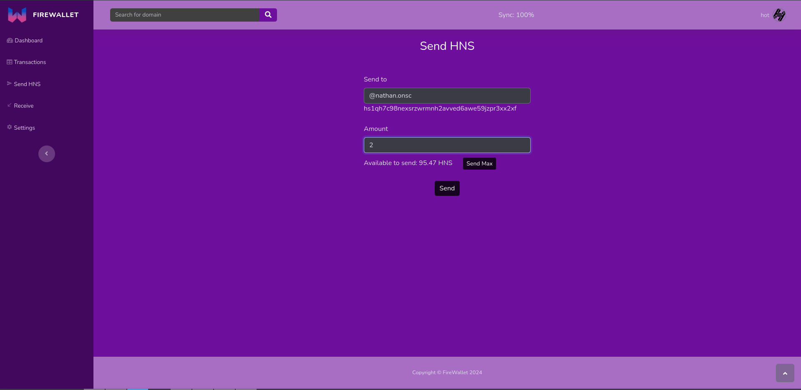

Transaction confirmation  
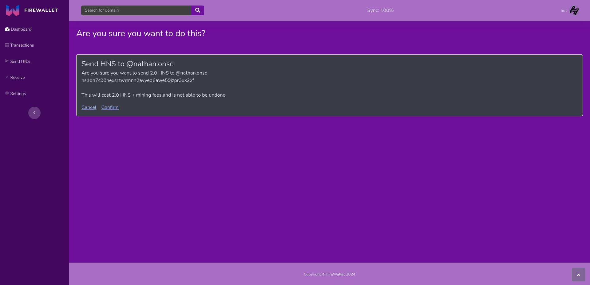

Receive page  
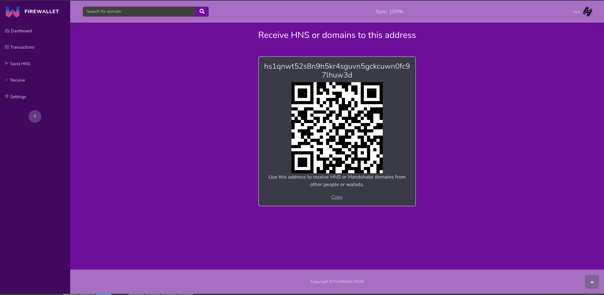

Settings page  
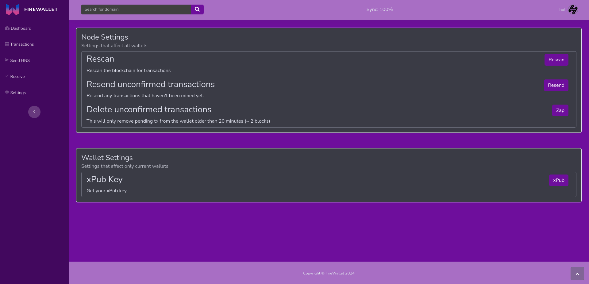

Domain page  
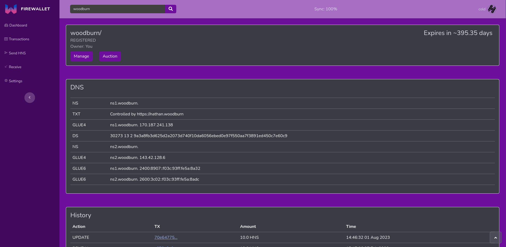

Domain management page  
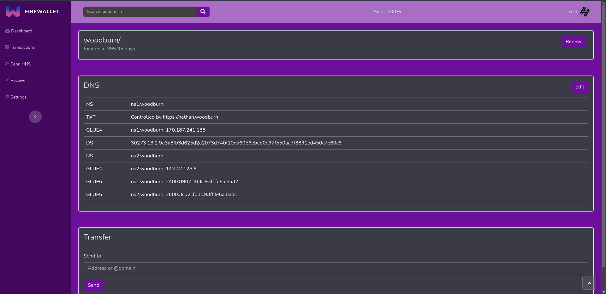

DNS Editor page
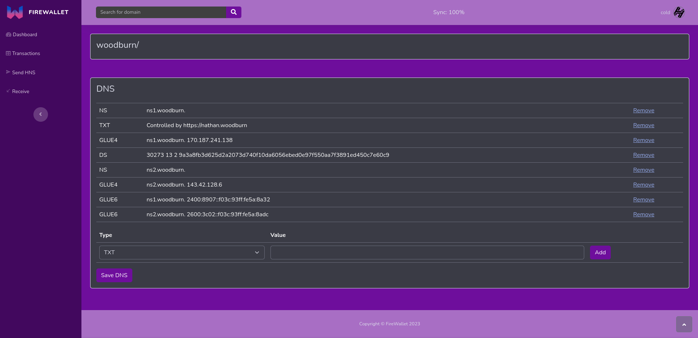

Auction page
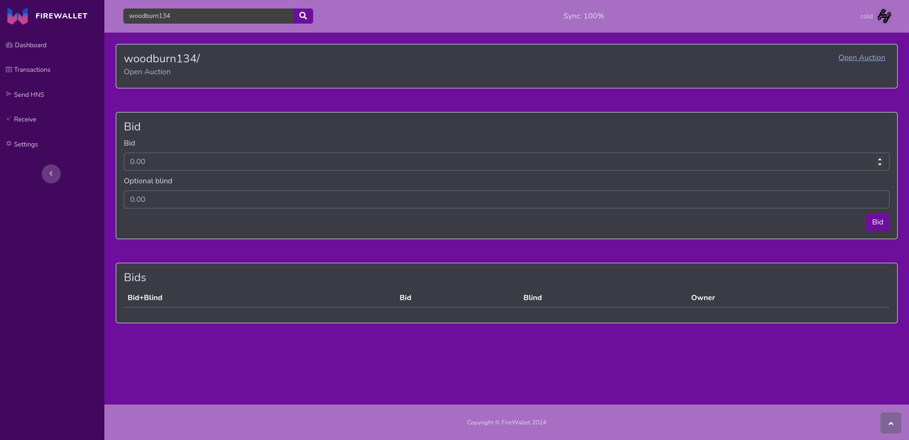

## Environment variables

```yaml
hsd_api: HSD API key
hsd_ip: HSD IP address
theme: Theme to use (dark-purple, black)
show_expired: Show expired domains (true/false)
exclude: Comma separated list of wallets to exclude from the wallet list
```


## Warnings

- This is a work in progress and is not guaranteed to work
- This is not a wallet by itself but rather a frontend for HSD
- I am not responsible for any loss of funds from using this wallet (including loss of funds from auctions)
- I am not responsible if you expose this frontend to the internet (please don't do this unless you know what you are doing)